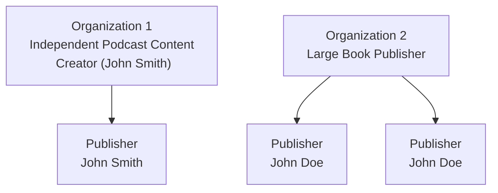

To support a robust permission and ownership model, the Gloo AI platform is built around two primary entities: Organizations and Publishers. Understanding this structure is key to managing your content, users, and data effectively.

---

## Organizations: The Source of Truth for Ownership

An Organization (often shortened to "Org") represents the root entity in Gloo AI's multi-tenant architecture. All data, models, projects, and assets are scoped to a specific Organization, ensuring a secure boundary for your work.

An Organization's core capabilities include:

-   **Data Isolation:** Data stored under an Org is completely isolated from all other Orgs in both storage and compute.
-   **Access Control:** Only users explicitly added to the Org can access or act on its resources, based on their assigned roles.
-   **Audibility:** All actions taken on Org-owned assets are logged and attributable to specific users, supporting regulatory and internal audit requirements.

## Publishers: Creating and Curating on Behalf of an Org

A **Publisher** is a specific persona or sub-entity within an Organization that produces and maintains AI assets (e.g., models, datasets, assistants, templates, content). Publishers allow Gloo Studio to support a separation of identity from ownership, while preserving control.

Think of a Publisher as a brand, team, or public-facing identity within an Org. Key features include:

-   Assets are created by a Publisher.
-   Publishers can only act within their parent Org.
-   Access to create and edit content is role-gated and auditable.

## Conceptual Models: How to Think About the Structure

Our structure for organizing content creators allows for flexibility and scalability, so Gloo AI Studio's tools can be used by individual content creators and large book publishers alike. There are two common models:

The diagram below shows two common examples of how this works.

-   **The Independent Creator:** Smaller organizations who do not have internal divisions, like a podcast host, can be represented by a single Organization and a single Publisher. In this case, the Organization and Publisher serve the same person or entity, providing a simple but secure container for their work.

-   **The Large Enterprise:** Larger organizations are represented by a structure where the overarching Organization has rights to all of its subsidiary data. For example, a singular book publisher works as an Organization, and the individual authors or imprints act as Publishers underneath that organization.

## Security by Design

Behind the scenes, Gloo enforces a strict multi-tenant security model to protect your data.

-   **Logical and physical isolation** at the storage layer (S3, DB, vector store).
-   **Org ID propagation** in every API and job submission request.
-   **Zero-leakage guarantee:** No customer or IP data is ever exposed to another Org.
-   **Gloo Studio Audit Layer:** Full traceability of actions, changes, and data movement across Orgs and Publishers.
